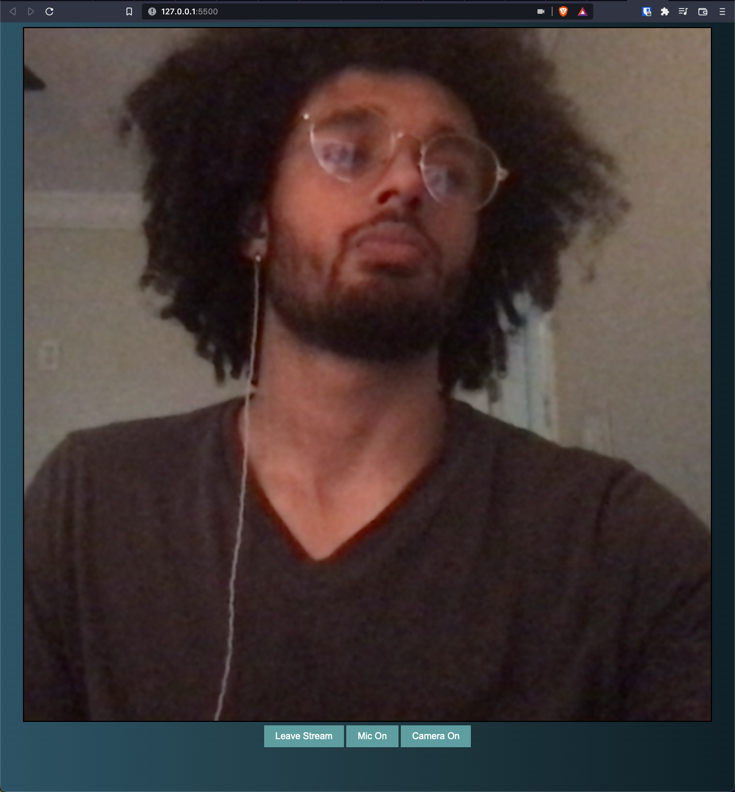
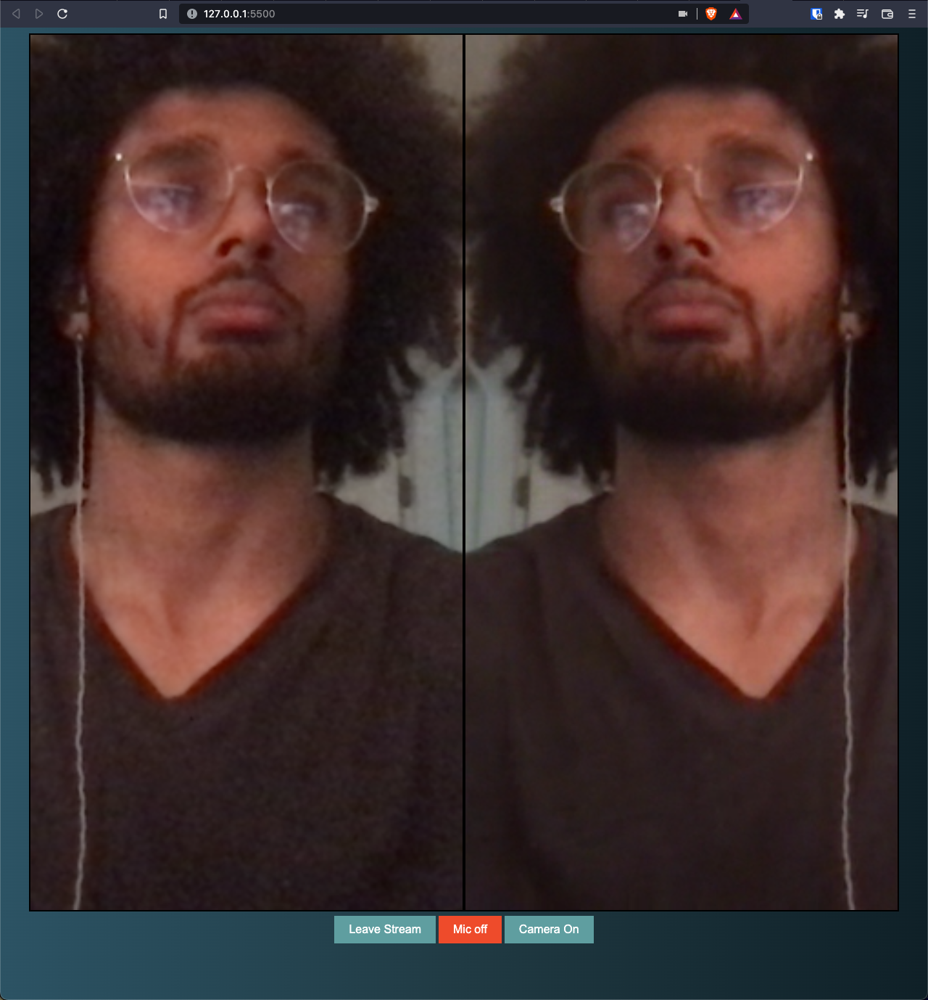
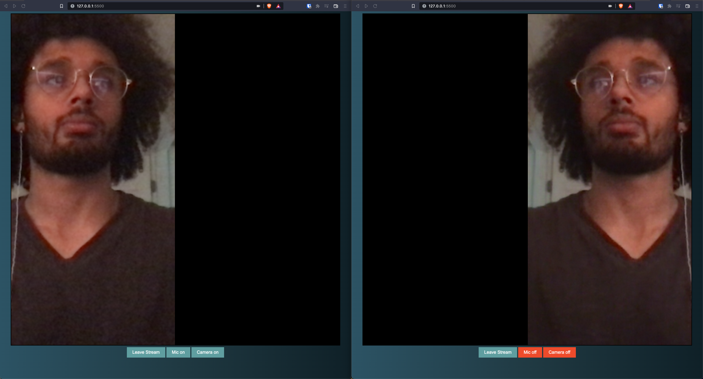

# group-video-chat

Group video chat app built using HTML, CSS, JavaScript, and the Agora SDK.

# Installation

- 1 - clone repo https://github.com/tjpreston96/group-video-chat
- 2 - Create an account on agora.io and get APP ID, Temp Token and Channel Name
- 3 - Update APP ID, Temp Token and Channel Name in script.js

# Images

## Landing (Home)

## Single User

## Multiple Users

## Camera and Mic Muted

